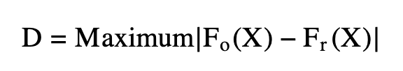

```{r setup, include=FALSE}
knitr::opts_chunk$set(echo = TRUE)
```

## Introduction

Before starting to work with a data set you have to figure out what kind of data it is. Goodness of fit tests report if your data is normal or matches with expected data. Then you are able to pick the best statistical test to run on your data. Different data types have different goodness of fit tests and each test is used to draw different conclusions. The G test is a variation of the chi-squared test and determines if your data matches an expected distribution. The  Kolmogorov-Smirnov test determines if the observed data matches a normally distributed population. Anderson-Darling test is derived from the Kolmogorov-Smirnov test and is more sensitive to the distribution edges. The Shapiro-Wilks test also determines if a random sample is from a normally distributed population but is used for smaller sample populations under 2000.


## Packages
```{r Packages}
# G test
library(DescTools)
library(curl)

```

## G–test of goodness-of-fit

Like the Chi-squared test in Module 14 the G test allows you to determine if there is a significant difference in proportions of a categorical variable to the theoretical expectation. Chi-squared test give approximately the same results as G test but you can perform more elaborate statistical analyses with G test results. Downside is that less people are familar with the G test compared to the Chi-squared test. You cannot use both and pick the one that gives you a better result. Pick one and stick with it. 

Both G test and Chi-squared Test data needs to fulfill certain assumptions: 

1. Random Sample <br>
2. Independence between samples <br>
3. Variable must be proportional or categorical <br>
4. Mutually exclusive categories <br>
5. Variables must have 2 or more options <br>


You should use the G test over the Chi-squared Test if 

1. There are more than 1000 values in total.
2. There are outliers in the data

Null Hypothesis: The observed data has the same porportions as the expected theoretical population. 
Alternate Hypothesis: The observed data doesn't have the same porportions as the expected theoretical population. 

## Running the Test

``` {r Generating Data, include=FALSE, eval=FALSE}

set.seed(1)
Flower.color <- sample(x = c("purple", "white", "orange", "blue"), prob= c(.5, .35, 0.05, 0.1), size = 1200, replace = TRUE)

Flower.size <- sample(x = c("Large", "Small"), prob= c(0.5, 0.5), size = 1200, replace = TRUE)


Flower.species <- sample(x = c("Siberian", "Japanese", "Dutch", "Bearded"), prob= c(.25, .25, 0.25, 0.25), size = 1200, replace = TRUE)

Flower.location <- sample(x = c("North", "East", "South", "West"), prob= c(.2, .30, 0.30, 0.2), size = 1200, replace = TRUE)

Data <- cbind(Flower.color, Flower.size, Flower.species, Flower.location)
head(Data)
write.csv(Data, "C:\\Users\\Emily\\Documents\\Github\\Chisquare-repo\\Iris.csv", row.names=TRUE)
```
Formula <br>

# G=2 * Σ[O * ln(O/E)]

O = Observed
E = Expected

I was out in the field and collected data about 1200 Irises. I noted the color, size, species, and location of each flower. I want to know if there is proportionally equal amounts of each flower color. 

<center></center>

```{r Tabulating Data}

d <- read.csv("Iris.csv", header = TRUE, sep = ",", stringsAsFactors = FALSE)
head(d)

table(d$Flower.color) # Count how many of each color

# Find the G value
G <- 2 * ((121 * log(121/300)) + (59 * log(59/300)) + (628 * log(628/300)) + (392 * log(392/300)))

G # Use G value to find p-value

pchisq(725.9525, df=3, lower.tail = FALSE) # Finding the p-value
```
We got an output of 725.95 and the degree of freedom is options-1 and calculated a p-value of 4.9e-157 which is below the critical p-value = 0.05. We can reject the null hypothesis and conclude that the flower color proportions of the Irises observed are not equally distributed. 

```{r Coding}

#perform the G-test 
GTest(x = c(121, 59, 628, 392), #observed values
      p = c(1/4, 1/4, 1/4, 1/4)) #expected proportions
  
```

Once again the p-value is below 0.05. We can reject the null hypothesis and conclude that the flower color proportions of the Irises I observed are not equally distributed. 


## Challenges

Go through the same process with Flower.size, Flower.location and Flower.species.

### Sources
https://www.statology.org/g-test/ <br>
https://www.statstest.com/g-test/ <br>
https://www.biostathandbook.com/gtestgof.html <br>
https://www.r-bloggers.com/2022/05/calculate-the-p-value-from-chi-square-statistic-in-r/ <br>
https://stats.libretexts.org/Bookshelves/Applied_Statistics/Biological_Statistics_(McDonald)/02%3A_Tests_for_Nominal_Variables/2.04%3A_GTest_of_Goodness-of-Fit <br> <br>
<br>
We can use the <b>Kolmorgorov-Smirnov Test</b> as a way to reject null hypotheses. By using this statistical method we are aiming to prove that the two data sets we are working with do not come from the same distribution.

The most common way to reject the null is with a student's t-test, however, this can only be accurately used when we know our data set is <b>normal</b>. If we are using data that we aren't sure about, or know isn't of a normal distribution it can be trickier to reject this hypothesis. That's where the Kolmorgorov-Smirnov Test comes into play. The most important time to think about using this test is when you have a very large data set (n &ge; 50) as opposed to the Shapiro-Wilks test which is better for smaller data sets. 

If we are running a one-sample K-S Test, our null is that the sample comes from the same distribution as the data set we are comparing it with.

If we are running a two-sample K-S Test, our null is that both samples come from the same distribution. 

So why is it important to disprove the null?
Failing to reject a null hypothesis means there is no sufficient evidence for the expected or the observed results we see in our studies.

## Equation ##



<b>F<sub>0</sub>(x)</b> = the total observed frequency distribution of a random sample

<b>F<sub>0</sub>(x) = <sup>k</sup>&frasl;<sub>n</sub></b> where k = the number of observations and n is the total number of observations

<b>F<sub>r</sub>(x)</b> = the theoretical frequency distribution

<b>D</b> = the critical value between 0 and 1 indicating the magnitude of the observed difference in distributions. Values closer to 1 difference, while values closer to 0 indicate high likeness. Unlike a p-value which has a set threshold for whether something is significant or not--although this is also not necessarily the be-all-end-all of significance!--the D value produced from the K-S test is relative to each individual distribution. <b>Different data sets will produce different D values!</b>

If the calculated value is <b>less</b> than the critical value <b>D</b> we must <b>accept the null hypothesis</b>

If the calculated value is <b>greater</b> than the critical value we can <b> reject the null hypothesis</b>

### One-Sample Test ###
Let's do an example!
Say we are zoologists studying turtles. We want to conduct an experiment to see if different species of turtle prefer to eat cucumbers or lettuce when presented with both. We are going to use 5 different species and count how many turtles go for each food choice first in each population (n = 150).
```{r 2, include=TRUE}
# create matrix with 5 columns and 2 rows
data <- matrix(c(16, 12, 1, 22, 11, 14, 18, 29, 8, 19), nrow = 2, ncol = 5, byrow = TRUE)
# specify the column names and row names of matrix
colnames(data) <- c('A.marmorata ','C.fimbriata ','C.picta ','C.flavomarginata ', 'C.amboinensis')
rownames(data) <-  c('Cucumber','Lettuce')
# assign to table
final = as.table(data)
# display
final
```
<b>H<sub>0</sub></b> = There is no difference among turtle species with respect to their choice of cucumber over lettuce.

<b>H<sub>1</sub></b> = There is a difference among turtle species with respect to their choice of cucumber over lettuce

Let's say we predict 18 turtles from each species choose cucumber and make a new table with our prediction.

```{r 4, include=TRUE}
#appending our original table
final_new <- final 
#assigning a new row name and filling in the data using the list function
final_new <- rbind(final_new, 'Predictions' = list(18, 18, 18, 18, 18)) 
#ready to print!
final_new
```
```{r 5, include=TRUE}
calculations <- matrix(c(16, 18, '16/150', '18/150', '2/150', 12, 18, '28/150', '36/150', '8/150', 1, 18, '29/150', '54/150', '25/150', 22, 18, '51/150', '72/150', '21/150', 11, 18, '62/150', '90/150', '28/150'), nrow = 5, ncol = 5, byrow = TRUE)
colnames(calculations) <- c('Observed ','Predictions ','F0(X)', 'Fr(X)', '|F0(X) -Fr(X)|')
rownames(calculations) <-  c('A.marmorata ','C.fimbriata ','C.picta ','C.flavomarginata ', 'C.amboinensis')
table = as.table(calculations)
table
```
Now it's time to analyze! To find our critical D value we need to look at our table and find the maximum difference between F<sub>0</sub>(x) and F<sub>r</sub>(x). We can see that our maximum value is that of C. amboinensis at 28/150. Our critical D value that we will use to compare our values to is 0.1867. Now we can look at our table and choose a value of alpha to work with. Say we are 5% certain we are going to make a Type 1 error, i.e. detecting a difference under the assumption of the null, we can use our table to choose our critical value.


```{r 6, include=TRUE}
#denote the total number of turtles
n <- 150
#grab our formula
D <- 1.36/sqrt(n)
#calculate!
D
```
Our critical value for our data set at an alpha level of 5% is 0.11, which is smaller than our critical value of 0.1867. Because our value is <b>greater</b> than the critical value, we can reject the null and conclude that there is difference among turtle species with their respect to choosing cucumber over lettuce for their snack of choice!

## Challenge 1

Assuming an alpha level of 0.01, what is the critical D value for our sample? Can we still reject the null?

```{r 7, include=TRUE}
#denote the total number of turtles
n <- 150
#grab our formula
D <- 1.63/sqrt(n)
#calculate!
D
```
YES! 0.133 &#8804; 0.1867, therefore we can still reject the null.

Now let's do an example with a data set we are familiar with.
```{r 8, include=TRUE}
#prep to curl our data
library(curl) 
#curl our data
f <- curl("https://raw.githubusercontent.com/fuzzyatelin/fuzzyatelin.github.io/master/AN588_Fall23/zombies.csv")
#read our csv
z <- read.csv(f, header = TRUE, sep = ",", stringsAsFactors = TRUE)
#call our data set
head(z)
```

Now for the easy way! The function for a KS test is built into R, a one-sample test can be called using the ks.test() function. With a one-sided test we are looking to see if the data follows a normal distribution, hence the "pnorm" is what we are testing for. Let's look at age:
```{r 9, include=TRUE}
#call our column of interest
age <- z$age
#use our function!
ks.test(age, "pnorm")
```
Our p-value is going to tell us if we can accept or reject the null, in this case, that the data we are working with is normally distributed. Since our value is &#60; 0.05 we can reject the null and say that our data is not normally distributed. 
```{r 12, include=TRUE}
#denote the total number of turtles
n <- 1001
#grab our formula
D <- 1.63/sqrt(n)
#calculate!
D
```
Our calculated value of D is 0.05 which is smaller than our critical value of 1. This also makes sense, and confirms our ability to reject the null.

Now let's do a two-sample test.

First let's make two data sets, one random, and one normal.
```{r 13, include=TRUE}
#make this example reproducible
set.seed(0)
#generate two data sets. We are using rpois() to ensure a non-normal distribution, and rnorm() to ensure a normalized one.
data1 <- rpois(n=50, lambda=5)
data2 <- rnorm(100)
```

```{r 14, include=TRUE}
#using our function, we are going to fill both arguments with the data sets to ensure a comparison
ks.test(data1, data2)
```

Now we can look at both our D value and p-value. Our p-value is < 0.05 and therefore allows us to reject the null. Our data sets come from two different distributions, which is what we expected since we made them that way! Our D value is 0.95, going back to our previous table we can pick an alpha value of 0.05.


```{r 15, include=TRUE}
#denote the total number of turtles
n12 <- (150 + 50)/(150*50)
#grab our formula
n12 <- sqrt(n12)
#calculate!
D <- n12*0.05
D
```
Our calculated value of D is 0.00816 which is smaller than our critical value of 0.95. This also makes sense, and confirms our ability to reject the null.

If you're curious about seeing a KS Test in action, feel free to check out <a href="Mizumoto&al2022.pdf">this</a> paper on same-sex sexual behavior in termites.

## Sources
https://www.tutorialspoint.com/statistics/kolmogorov_smirnov_test.htm <br>
https://towardsdatascience.com/understanding-kolmogorov-smirnov-ks-tests-for-data-drift-on-profiled-data-5c8317796f78 <br>
https://www.itl.nist.gov/div898/handbook/eda/section3/eda35g.htm <br>
https://www.researchgate.net/post/Interpret_P_and_D_values_in_Two-Sample_Kolmogorov-Smirnov_Test <br>
https://www.statisticshowto.com/kolmogorov-smirnov-test/ <br>
https://blogs.sas.com/content/iml/2019/05/15/kolmogorov-d-statistic.html <br>
https://www.sciencedirect.com/topics/earth-and-planetary-sciences/kolmogorov-smirnov-test <br>
https://stat.ethz.ch/R-manual/R-devel/library/stats/html/ks.test.html <br>
https://www.statology.org/kolmogorov-smirnov-test-r/ <br>

